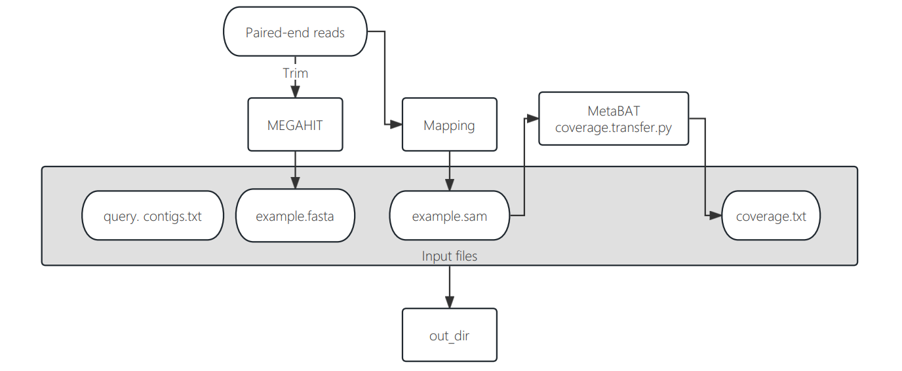

<font face="MiSans">
<br/>

# COBRA
> [COBRA (Contig Overlap Based Re-Assembly)](https://github.com/linxingchen/cobra?tab=readme-ov-file)  
## workflow
### PreRun
1. Paired-end reads
2. Use assemblers such as Megahit, MetaSpades
3. Mapping with Bowtie2 or BBMap
4. Use MetaBAT to obtain the coverage file
```Shell
jgi_summarize_bam_contig_depths --outputDepth original.coverage.txt *sam(or *bam)
```
Then use coverage.transfer.py (in COBRA)
```Shell
python coverage.transfer.py -i original.coverage.txt -o coverage.txt
```
OR use [CoverM](https://github.com/wwood/CoverM) / [PyCoverM](https://github.com/apcamargo/pycoverm)

### Input files
1. ```-f``` fasta file assembled by megahit...
2. ```-c``` a two columns (separated by tab) file of the sequencing coverage of all contigs in the -f/--fasta file, example below:
```
contig-140_1    42.1388
contig-140_2    14.6023
contig-140_3    15.4817
contig-140_4    41.2746
...
```
3. ```-q``` the query contigs that the user wants COBRA to extend, could be provided in a fasta format file, or a one-column text file with the names of the query contigs. 
4. ```-m``` the paired-end reads mapping file of all contigs in the -```f``` file, could be sam or bam file.

### Parameters & Flags
* ```-a/--assembler```: the name of the de novo assembler used, currently only 'idba' (for IDBA_UD), 'metaspades' (for metaSPAdes), and 'megahit' (for MEGAHIT).
* ```-maxk/--maxk```: the largest kmer used in de novo assembly.
* ```-mink/--mink```: the smallest kmer used in de novo assembly.
> Above parameters are necessary
* ```-lm/--linkage_mismatch```: the number of read mapping mismatches allowed when determining if two contigs were spanned by paired reads.
* ```-o/--output```: the name of the output folder, otherwise it will be "{-q/--query}.COBRA" if not provided.
* ```-t/--threads```: the number of threads used for BLASTn search.
> Above are optional
### Running
```Shell
cobra-meta -f input.fasta -q query.fasta -c coverage.txt -m mapping.sam -a idba -mink 20 -maxk 140
```
## Output files
```
COBRA_category_i_self_circular_queries_trimmed.fasta
COBRA_category_i_self_circular_queries_trimmed.fasta.summary.txt
COBRA_category_ii_extended_circular_unique (folder)
COBRA_category_ii_extended_circular_unique.fasta
COBRA_category_ii_extended_circular_unique.fasta.summary.txt
COBRA_category_ii_extended_circular_unique_joining_details.txt
COBRA_category_ii_extended_failed.fasta
COBRA_category_ii_extended_failed.fasta.summary.txt
COBRA_category_ii_extended_partial_unique (folder)
COBRA_category_ii_extended_partial_unique.fasta
COBRA_category_ii_extended_partial_unique.fasta.summary.txt
COBRA_category_ii_extended_partial_unique_joining_details.txt
COBRA_category_iii_orphan_end.fasta
COBRA_category_iii_orphan_end.fasta.summary.txt
COBRA_joining_status.txt
COBRA_joining_summary.txt
intermediate.files (folder)
log
debug.txt
contig.new.fa
```

**More details in github**